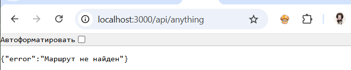

# Лабораторная работа №1: Настройка среды разработки и первый HTTP-сервер

**Студент:** Осипенко Юлия Юрьевна
**Группа:** ПИЖ-б-о-25-1
**Вариант:** 5
**Технология:** Node.js + Express

## Содержание
  
- [Лабораторная работа №1: Настройка среды разработки и первый HTTP-сервер](#лабораторная-работа-1-настройка-среды-разработки-и-первый-http-сервер)
  - [Содержание](#содержание)
  - [Цель работы](#цель-работы)
  - [Теоретическое обоснование](#теоретическое-обоснование)
  - [Выполнение практического примера](#выполнение-практического-примера)
    - [Код сервера](#код-сервера)
  - [Выполнение индивидуального задания](#выполнение-индивидуального-задания)
    - [Код сервера](#код-сервера-1)
  - [Контрольные вопросы](#контрольные-вопросы)
  - [Вывод](#вывод)

## Цель работы 
Освоить установку инструментов для бэкенд-разработки, создать и запустить минимальный веб-сервер, обрабатывающий GET-запросы, понять концепцию эндпоинтов, научиться настраивать автоматический перезапуск сервера.

## Теоретическое обоснование

**Бэкенд-разработка** — это создание серверной части веб-приложений, которая обрабатывает запросы клиентов, выполняет бизнес-логику и взаимодействует с базами данных. В основе взаимодействия лежит клиент-серверная архитектура: клиент (браузер, мобильное приложение) отправляет HTTP-запрос, сервер обрабатывает его и возвращает ответ.

**Эндпоинт** (endpoint) — это конкретный URL вместе с методом HTTP, по которому клиент обращается к серверу. Маршрутизация (routing) сопоставляет путь запроса с функцией-обработчиком. В данной работе используется метод GET, предназначенный только для получения данных (идемпотентный).

**JSON** (JavaScript Object Notation) — текстовый формат обмена данными, ставший стандартом для REST API благодаря своей простоте и читаемости.

## Выполнение практического примера

### Код сервера

```javascript
const express = require('express');
const app = express();
const port = 3000;

// Логирование запросов
app.use((req, res, next) => {
  console.log(`[${new Date().toISOString()}] ${req.method} ${req.url}`);
  next();
});

// Текстовый эндпоинт
app.get('/', (req, res) => {
  res.send('Добро пожаловать на базовый сервер!');
});

// JSON-эндпоинт 1
app.get('/api/status', (req, res) => {
  res.json({ status: 'ok', uptime: process.uptime() });
});

// JSON-эндпоинт 2
app.get('/api/info', (req, res) => {
  res.json({ author: 'Student', version: '1.0.0' });
});

// Эндпоинт с параметром
app.get('/api/users/:id', (req, res) => {
  res.json({ message: 'Информация о пользователе', userId: req.params.id });
});

// Обработка 404
app.use((req, res) => {
  res.status(404).json({ error: 'Маршрут не найден' });
});

app.listen(port, () => {
  console.log(`Сервер запущен на http://localhost:${port}`);
});
```

В браузере проверяем эндпоинты:

http://localhost:3000/ — текстовый ответ


http://localhost:3000/api/status — JSON


http://localhost:3000/api/info — JSON


http://localhost:3000/api/users/5 — JSON с параметром


http://localhost:3000/anything — ошибка 404



## Выполнение индивидуального задания

### Код сервера

```javascript
const express = require('express');
const app = express();
const port = 3000;

// Консольное логинирование каждого запроса
app.use((req, res, next) => {
  console.log(`[${new Date().toISOString()}] ${req.method} ${req.url}`);
  next();
});

// 1. Текстовый эндпоинт
app.get('/', (req, res) => {
  res.send('Сервер работает');
});

// 2. JSON-эндпоинт: 1  
app.get('/api/movies', (req, res) => {
  res.json([
    { id: 1, title: 'Интерстеллар', year: 2014, genre: 'Sci-Fi' },
    { id: 2, title: 'Начало', year: 2010, genre: 'Thriller' },
    { id: 3, title: 'Матрица', year: 1999, genre: 'Sci-Fi' }
  ]);
});

// 3. JSON-эндпоинт: 2
app.get('/api/cinemas', (req, res) => {
  res.json([
    { id: 1, name: 'Синема Парк', city: 'Москва' },
    { id: 2, name: 'КАРО Фильм', city: 'Санкт-Петербург' },
    { id: 3, name: 'Формула Кино', city: 'Казань' }
  ]);
});

// 4. JSON-эндпоинт с параметром: 
app.get('/api/movies/:id', (req, res) => {
  res.json({
    requestedId: req.params.id,
    status: 'success',
    message: `Запрошен фильм с ID = ${req.params.id}`
  });
});

// Обработка 404 
app.use((req, res) => {
  res.status(404).json({ error: 'Not Found' });
});

app.listen(port, () => {
  console.log(`Сервер запущен на http://localhost:${port}`);
});
```

В браузере проверяем эндпоинты:

http://localhost:3000/ — текстовый ответ


http://localhost:3000/api/movies — JSON


http://localhost:3000/api/cinemas — JSON


http://localhost:3000/api/movie-id — JSON с параметром


http://localhost:3000/404 — ошибка 404


## Контрольные вопросы

**1. Что такое клиент-серверная архитектура?**

Это модель взаимодействия, где клиент (браузер, приложение) отправляет запросы, а сервер обрабатывает их и возвращает ответы.

---

**2. Какой протокол используется для общения клиента и сервера в вебе?**

Это основной протокол передачи данных в интернете

---

**3. Что такое эндпоинт (endpoint)?**

Это конкретный адрес (URL) вместе с методом
HTTP, по которому клиент обращается к серверу для получения ресурса.

---

**4. Какую структуру имеет HTTP-запрос и HTTP-ответ? Что такое код состояния (status code)?**

HTTP-запрос содержит: метод, URL, заголовки, тело (опционально). HTTP-ответ содержит: код состояния, заголовки, тело. Код состояния — трёхзначное число, указывающее результат обработки запроса (например, 200 — успех, 404 — не найдено).

---

**5. Что такое JSON? Почему он популярен в веб-разработке?**

Это текстовый формат обмена данными на основе синтаксиса JavaScript.

---

**6. Как запустить сервер на Node.js или Flask?**

node app.js для Node.js и python app.py для Flask

---

**7. Что такое автоматический перезапуск сервера и зачем он нужен? Какой пакет используется для Node.js?**

Это перезапуск сервера при изменении кода, чтобы не делать это вручную. Для Node.js используется пакет nodemon.

---

**8. Какие коды состояния HTTP вы знаете? За что отвечает код 404?**

Коды HTTP: 200 (OK), 201 (Created), 400 (Bad Request), 401 (Unauthorized), 403 (Forbidden), 404 (Not Found) — ресурс не найден, 500 (Internal Server Error) и др. Код 404 означает, что запрошенный URL не существует на сервере.

---

**9.  Что такое middleware в Express / декораторы запросов во Flask (для продвинутого уровня)?**

Middleware в Express — функции, выполняющиеся до обработчика маршрута, могут изменять запрос/ответ или завершать цикл. Во Flask аналоги — декораторы (например, @app.before_request) для выполнения кода до/после запроса.

---

**10. Как получить параметр из URL-пути (например, ID пользователя) в вашем фреймворке?**

В Express параметр пути получается через req.params.имя (например, req.params.id)

---

## Вывод

Освоила установку инструментов для бэкенд-разработки, создала и запустила минимальный веб-сервер, обрабатывающий GET-запросы, поняла концепцию эндпоинтов, научилась настраивать автоматический перезапуск сервера.

---
Список использованных источников

1. **Node.js официальная документация** — https://nodejs.org/en/docs/
2. **Express официальная документация** — https://expressjs.com/
3. **Flask официальная документация** — https://flask.palletsprojects.com/
4. **HTTP протокол (MDN)** — https://developer.mozilla.org/ru/docs/Web/HTTP
5. **JSON (MDN)** —
https://developer.mozilla.org/ru/docs/Web/JavaScript/Reference/Global_Objects/JS
ON
6. **Nodemon документация** — https://nodemon.io/
7. **Postman документация** — https://learning.postman.com/docs/getting-
started/introduction/
8. **REST API — основные принципы (GeeksforGeeks)** —
https://www.geeksforgeeks.org/node-js/explain-the-concept-of-restful-apis-in-
express
